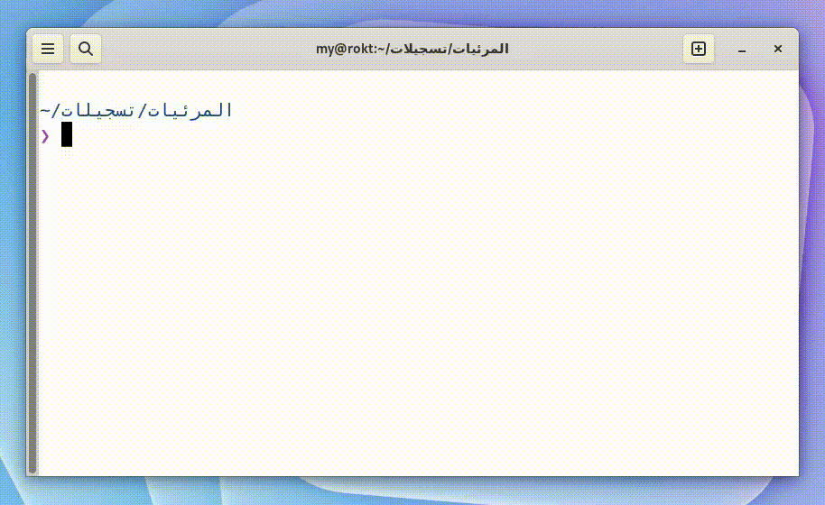

Azmena is a CLI app to calculate video files total duration in your directories.

### Download your version from [here](https://github.com/mdyssr/azmena-cli/releases/)

##### Important: The Azemna CLI tool uses [ffmpeg](https://ffmpeg.org/) under the hood, so make sure you have ffmpeg installed and added to PATH on your system.
